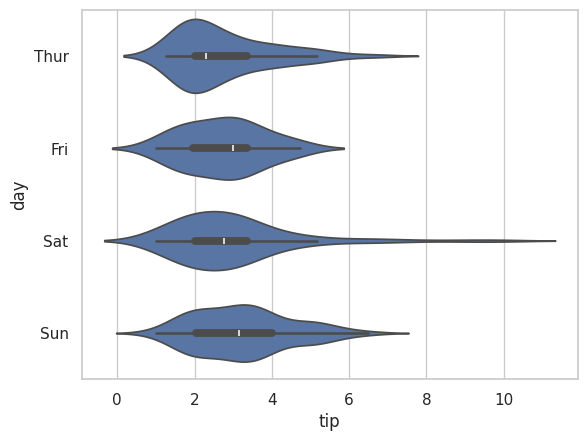
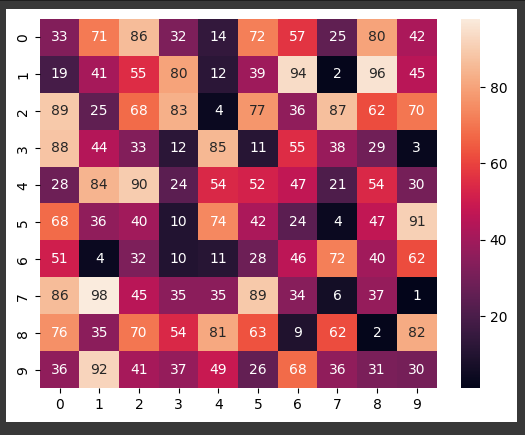

# EXNO-6-DS-DATA VISUALIZATION USING SEABORN LIBRARY

# Aim:
  To Perform Data Visualization using seaborn python library for the given datas.

# EXPLANATION:
Data visualization is the graphical representation of information and data. By using visual elements like charts, graphs, and maps, data visualization tools provide an accessible way to see and understand trends, outliers, and patterns in data.

# Algorithm:
STEP 1:Include the necessary Library.

STEP 2:Read the given Data.

STEP 3:Apply data visualization techniques to identify the patterns of the data.

STEP 4:Apply the various data visualization tools wherever necessary.

STEP 5:Include Necessary parameters in each functions.

# Coding and Output:
```
import seaborn as sns
import matplotlib.pyplot as plt
df=sns.load_dataset("tips")
df
```

```
sns.lineplot(x="total_bill",y="tip",data=df,hue="sex",linestyle='solid',legend="auto")
```

```
x=[1,2,3,4,5]
y1=[3,5,2,6,1]
y2=[1,6,4,3,8]
y3=[5,2,7,1,4]
```
```
sns.lineplot(x=x,y=1)
sns.lineplot(x=x,y=y2)
sns.lineplot(x=x,y=y3)
plt.title('Multi-Line Plot')
plt.xlabel('X Label')
plt.ylabel('Y Label')
```

```
tips=sns.load_dataset('tips')
avg_total_bill=tips.groupby('day')['total_bill'].mean()
avg_tip=tips.groupby('day')['tip'].mean()
```
```
plt.figure(figsize=(8,6))
p1=plt.bar(avg_total_bill.index,avg_total_bill,label='Total Bill')
p2=plt.bar(avg_tip.index,avg_tip,bottom=avg_total_bill,label='Tip')

plt.xlabel('Day of the Week')
plt.ylabel('Amount')
plt.title('Average Total Bill and Tip by Day')
plt.legend()
```

```
avg_total_bill=tips.groupby('time')['total_bill'].mean()
avg_tip=tips.groupby('time')['tip'].mean()
```
```
p1=plt.bar(avg_total_bill.index,avg_total_bill,label='Total Bill',width=0.4)
p2=plt.bar(avg_tip.index,avg_tip,bottom=avg_total_bill,label='Tip',width=0.4)
plt.xlabel('Time of Day')
plt.title('Average Total Bill and tip by Time of Day')
plt.legend()
```

```
plt.bar(years, apples)
plt.bar(years, oranges, bottom=apples)
```

```
tips=sns.load_dataset('tips')
sns.scatterplot(x='total_bill',y='tip',hue='sex',data=tips)
plt.xlabel('Total Bill')
plt.ylabel('Tip Amount')
plt.title('Scatter Plot of Total Bill vs. Tip Amount')
```

```
import seaborn as sns
import numpy as np
import pandas as pd
import matplotlib.pyplot as plt
np.random.seed(0)
marks=np.random.normal(loc=70,scale=10,size=100)
marks
```

```
sns.histplot(data=marks,bins=10,kde=True,stat='count',cumulative=False,multiple='stack',element='bars',palette='set1',shrink=0.7)
plt.xlabel('Marks')
plt.ylabel('Density')
plt.title('Histogram of students Marks')
```

```
tips=sns.load_dataset('tips')
sns.boxplot(x=tips['day'],y=tips['total_bill'],hue=tips['sex'])
```

```
sns.boxplot(x="day",y="total_bill",hue="smoker",data=df,linewidth=2,width=0.6,boxprops={"facecolor":"lightblue","edgecolor": "darkblue"},
whiskerprops={"color":"black","linestyle":"--","linewidth":1.5},capprops={"color":"red","linestyle":"--","linewidth":1.5})
```

```
sns.violinplot(x="day",y="total_bill",hue="smoker",data=tips,linewidth=2,width=0.6,palette="Set3",inner="quartile")
plt.xlabel("Day of the Week")
plt.ylabel("Total Bill")
plt.title("Violin Plot of Total Bill by Day and Smoker status")
```

```

sns.set(style ="whitegrid")
tip=sns.load_dataset('tips')
sns.violinplot(x='day',y='tip',data=tip)
```

```
sns.set(style='whitegrid')
tip=sns.load_dataset('tips')
sns.violinplot(x=tip["total_bill"])
```

```
sns.set(style="whitegrid")
tips=sns.load_dataset("tips")
sns.violinplot(x="tip",y="day",data=tip)
```

```
sns.kdeplot(data=mart,x='PassengerId')
```

```
sns.kdeplot(data=mart,x='Age')
```

```
sns.kdeplot(data=mart)
```

```
sns.kdeplot(data=mart,x='PassengerId',hue='Survived',multiple='stack')
```

```
sns.kdeplot(data=mart,x='PassengerId',y='Survived')
```

```
data = np.random.randint(low = 1, high = 100, size = (10,10))
hm=sns.heatmap(data=data,annot=True)
```

```
hm=sns.heatmap(data=data)
```

# Result:
 Thus, all the data visualization techniques of Seaborn has been implemented.
